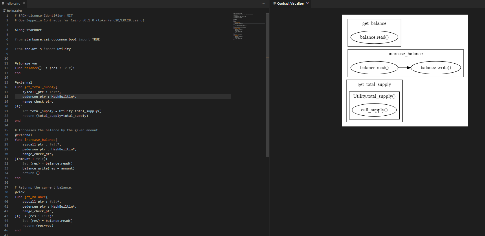
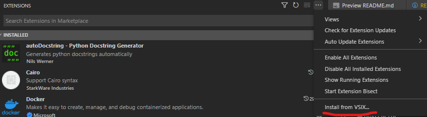

# Xenotracer

[](https://typescriptlang.org)
[](https://visualstudio.microsoft.com)

[](https://lbesson.mit-license.org/)



Xenotracer is a tool that will accelerate your smart contract development speed by visualizing the flow of function calls inside your contract, and the function calls between contracts. It is an extension of Visual Studio Code that you can use while you develop your smart contract in Visual Studio Code IDE. It is developed with Typescript. 

Currently, it supports visualizing the Cairo language.

## Why does Xenotracer exist?


No caption needed

## How to install

Currently, we haven't published our extension to the Visual Studio Code marketplace. 

For now, you can follow these steps instead to install it locally:

1. Install npm on your computer if you haven't. See [Developer Area](#developer_area).
2. Install vscm in npm `npm install -g vsce`
3. Clone this repository, then do `cd xenotracer`
4. Do, `vsce package`, it will output 'xenotracer-x.x.x.vsix' to the folder
5. On your Visual Studio Code, install it by going to your extension page. Click the three-dot and click `Install from VSIX`. Direct it to the `.vsix` file from the previous step.

6. It's installed! 

**Note**: We haven't released our first version, expect many bugs to happen!


## <a name="developer_area"></a> Developer Area

Do these steps to start developing or contributing Xenotracer's code.

- Install npm first: we use 16.x version. [Node JS](https://nodejs.org/)
- Install yarn [Here](https://classic.yarnpkg.com/lang/en/docs/install/)

Then do these steps!
```
yarn
yarn install
```

It will download all required packages

### Try Extension

Use F5 in your Visual Studio Code, then use the "Run Extension" option to try the extension.

### Contributing

To be announced in CONTRIBUTING.md

### Commiting

We use [commitizen](https://github.com/commitizen/cz-cli) to commit to make the commit message clean. 

Initialize the commitizen (if you haven't) by using this command.

```
commitizen init cz-conventional-changelog --yarn --dev --exact
```

If you get error that it's already setup in your place, ignore it.

To commit, use `cz` and write accordingly.

## Several Other Usages

- Unit test test: Do `yarn test`  
- check code quality: Do `yarn lint`

See `package.json` for more information!

## Other Links
[](https://twitter.com/xenosense)

## Core Contributors

**Alphabetically**
| [<br><sub>@haryoa</sub>](https://github.com/haryoa) | [<br><sub>@internnos</sub>](https://github.com/internnos) 
| :---------------------------------------------------------------------------------------------------------------------: | :-------------------------------------------------------------------------------------------------------------------------------------------: |

